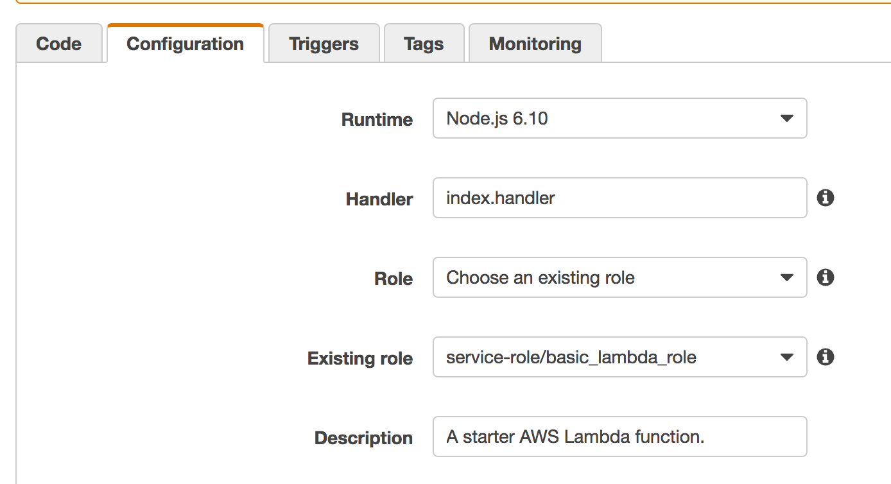

# EDQOS Plugins

This is a collection of plug-ins to the [Event Driven QoS](https://github.com/imapex/edqos_app)
application. EDQOS abstracts some of the complexity of the APIC-EM away so that
user applications can focus on interactions with the user, not with the APIC-EM.

## Current plugins
* [awsbutton](#awsbutton) - AWS lambda function code to tie an AWS IoT button to edqos.

### awsbutton

This project is an AWS Lambda function. It must be uploaded to AWS and configured
in a rule for an IoT button.

#### Requirements

Developing awsbutton requires [node.js](http://nodejs.org).

#### Installing awsbutton

After cloning the repository, the first step is

`npm install`

This will install the needed dependencies.

`grunt build`

This will create a zipfile under ./dist that can be uploaded directly into the
AWS lambda console.

`grunt deploy`

This will deploy the function to AWS. It requires that the function already
exist, and that you put its ARN into the Gruntfile.js file. As such, this is
primarily useful during development when re-deploying the function
repeatedly is useful.

#### AWS Configuration

Three environment variables are required in the console for the function to operate.

* The application variable is the name of the app to control with your button. It
must be spelled the same way that the APIC-EM has it spelled.

* The tag variable is the name of an APIC-EM policy tag to apply configuration to.
This must already exist.

* The url variable must point to a running instance of the [edqos_app](https://github.com/imapex/edqos_app). Use of the
docker container is the simplest way to deploy this. The README for that
app contains installation instructions.

The configuration tab for the function should use the Node.js 6.x runtime. The handler function name is index.handler.

#### Button configuration

The use of the AWS IoT smartphone application is recommended to do initial setup
of the button. Choose a sample function - the "send an SMS" function, for example -
during the configuration flow.

Once the button has been configured and tested, it is simple to change the target
of the rule created for the button to your new lambda function.

#### Testing

Push the button.

A single click will set the application defined in the lambda console to
Business-Relevant. A double-click will set the application to Business-Irrelevant.

The code does not at this time care what the existing state of the application is -
the state will be set to the category associated with the button push.
